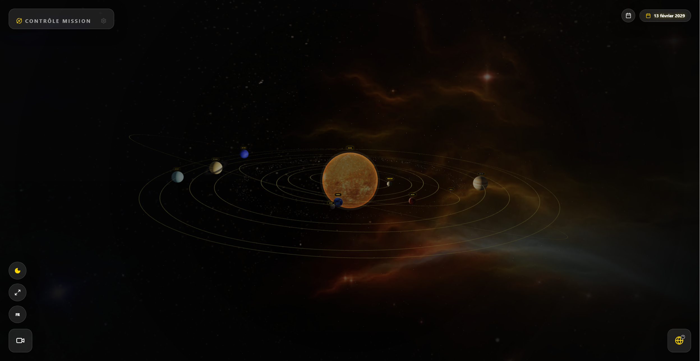

<div align="center">

</div>

# Solar System Three.js React UI

[](https://react.dev/)
[](https://www.typescriptlang.org/)
[](https://threejs.org/)
[](https://vitejs.dev/)
[](https://docs.pmnd.rs/react-three-fiber/getting-started/introduction)

An interactive **3D solar system simulation** built with **React**, **TypeScript**, **Three.js**, and **React Three Fiber** — combining scientific visualization, modular scene architecture, and real-date orbital simulation inspired by astronomical ephemerides.

---

## Overview

This project explores the intersection of web rendering and scientific education:

- Interactive 3D visualization in the browser with WebGL
- Ephemeris-inspired orbital positioning driven by real dates
- Modular, config + factory–driven scene architecture
- Clean UI controls for an immersive simulation experience

It serves as both a **technical playground** and a **portfolio-ready project**, with a focus on maintainability, extensibility, and visual quality.

---

## Features

### Simulation

- Date-driven orbital simulation with ephemeris-inspired angular positioning
- Configurable animation speed, pause/play, and seasonal shortcuts (Spring Equinox, Summer Solstice, Autumn Equinox, Winter Solstice)
- Config-driven visual scaling for distances and radii

### Scene

- Modular factory architecture for Sun, Planets, Moon, Rings, and Asteroid Belt
- Orbit and label visibility toggles
- Light presets for different visual moods
- Planet information drawer

### UI / UX

- Drawer-based modern interface
- Music and sound controls
- Date picker with seasonal shortcuts

---

## Tech Stack

- **React 19** + **TypeScript** + **Vite**
- **Three.js** + **@react-three/fiber** + **@react-three/drei**

---

## Project Structure

```text
solar-system-threejs-react-ui/
├─ public/
│  ├─ textures/
│  ├─ sounds/
│  ├─ musics/
│  └─ images/
├─ src/
│  ├─ App.tsx
│  ├─ main.tsx
│  ├─ components/
│  │  ├─ Scene.tsx
│  │  ├─ DatePickerModal.tsx
│  │  └─ ...
│  ├─ config/
│  │  ├─ simulationBodyConfigs.js
│  │  ├─ lightPresets.js
│  │  └─ constants.js
│  ├─ objects/
│  │  ├─ sunFactory.js
│  │  ├─ planetFactory.js
│  │  ├─ moonFactory.js
│  │  ├─ ringFactory.js
│  │  ├─ beltFactory.js
│  │  ├─ simulationVisuals.js
│  │  └─ sceneObjectUtils.js
│  └─ services/
│     └─ ...
├─ package.json
├─ tsconfig.json
└─ vite.config.ts
```

> The structure may evolve as the scene continues to be refactored.

---

## Architecture

The app is built around a **config + factory** pattern:

- `Scene.tsx` orchestrates the live scene and runtime interactions
- **Body configs** define simulation objects and their visual parameters
- **Factories** convert config entries into render models consumed by the scene
- **Visual scaling** maps real astronomical values into readable scene coordinates
- **Ephemeris data** is preserved independently from the simplified visual orbit model

### Visual Scaling Philosophy

This is not a strict 1:1 scale model. Displaying a real solar system at true scale makes most elements invisible or unreadable. Instead, this project balances:

- Scientific inspiration and date-accurate angular placement
- Visual readability with compressed orbital distances and adapted body sizes
- Maintainability through stable, config-driven orbit radii
- Future extensibility — ephemeris data can refine positions without breaking the visual layer

Some effects are intentionally simplified at this scale: orbital eccentricity, inclination, and ecliptic latitude.

### Ephemeris Approach

The current strategy separates **data fidelity** from **visual readability**:

- Full ephemeris data can be fetched and preserved
- Orbital angle is derived from ephemeris coordinates
- Rendered orbit radius remains config-driven and visually stable

This gives date-accurate angular placement without sacrificing the clarity of the scene.

---

## Getting Started

```bash
# Install dependencies
npm install

# Run development server
npm run dev

# Build for production
npm run build

# Type check / lint
npm run lint
```

---

## Recent Highlights

- Sun extracted into a dedicated factory + render model
- Asteroid belt placement moved into the config/factory pipeline
- Saturn rings restored via a dedicated ring render path
- Simulation date display refined: normal date while playing, weekday + date when paused
- Seasonal shortcuts added to the date picker
- Ongoing `Scene.tsx` cleanup by delegating logic to dedicated factories

---

## Roadmap

- Refine Moon factory and visual scaling
- Improve ring material tuning and transparency
- Optional orbital inclination and elliptical orbit approximation
- More polished mobile / responsive UI
- Better educational overlays and info panels
- Potential integration into a larger science or portfolio website

---

## Screenshots



---

## Demo

[Live Demo](https://darksalmon-jellyfish-454090.hostingersite.com/systeme_solaire_reactui_threejs/)

---

## Acknowledgments

- IMCCE / Miriade for ephemeris-based positioning concepts
- The React Three Fiber ecosystem
- Iterative AI-assisted refactoring workflows for architecture and UI exploration

---

## License

This project is currently shared for educational, experimental, and portfolio purposes. A formal open-source license (MIT, Apache-2.0) may be added in the future.
